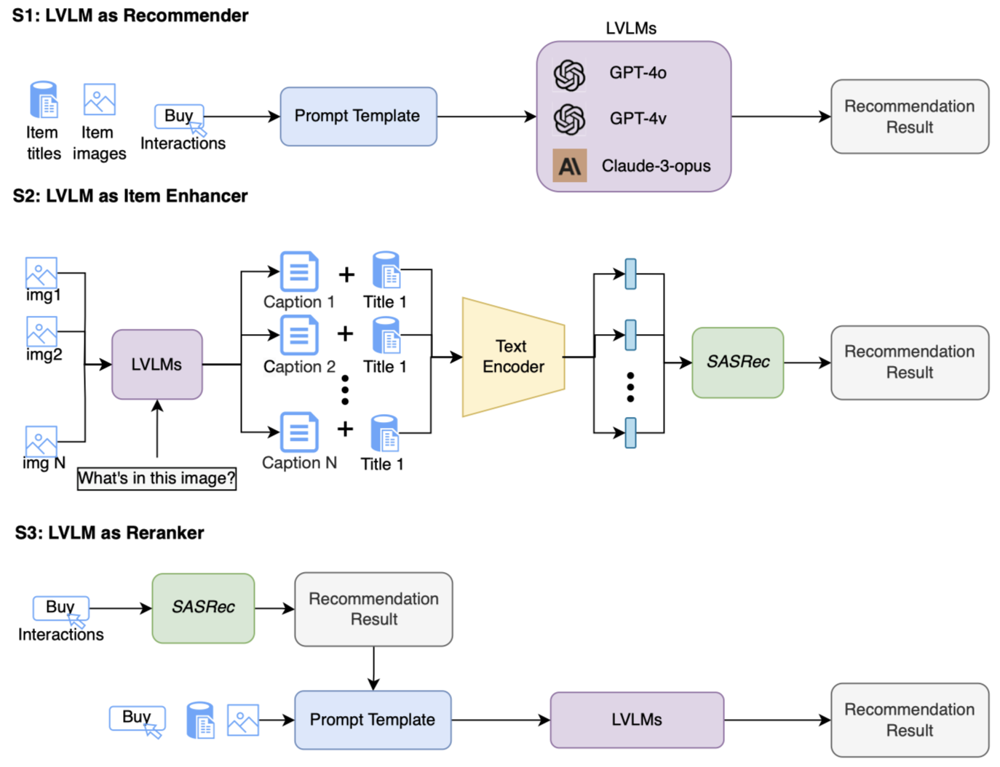
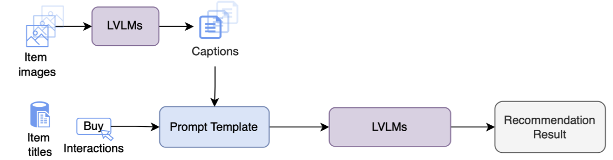
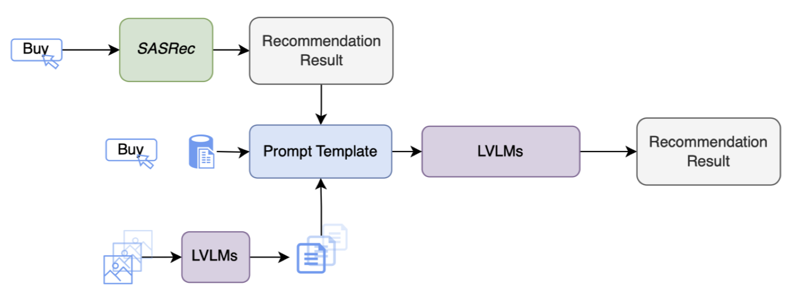

# MRecBench: Benchmarking Large Vision Language Models on Multimodal Recommendation

This repository includes the dataset and benchmark of the paper:

**MRecBench: Benchmarking Large Vision Language Models on Multimodal Recommendation (Submitted to NeurIPS 2024 Track on Datasets and Benchmarks).**

**Authors**: Peilin Zhou, Chao Liu, Jing Ren, Xinfeng Zhou, Yueqi Xie, Meng Cao, You-Liang Huang, Dading Chong, Guojun Yin, Wei Lin, Junling Liu, Jae Boum KIM, Shoujin Wang, Raymond Chi-Wing Wong, Sunghun Kim

## Abstract
Large Vision Language Models (LVLMs) have demonstrated considerable potential in various tasks that require the integration of visual and textual data. However, their employment in multimodal recommender systems (MRSs) has not been thoroughly investigated though they can play a significant role to greatly improve the performance of multimodal recommendations. To address this gap, we present MRecBench, the first comprehensive benchmark to systematically evaluate different LVLM integration strategies in recommendation scenarios. We benchmark three state-of-the-art LVLMs, i.e., GPT-4 Vision, GPT-4o, and Claude3-Opus, on the next item prediction task using the constructed Amazon Review Plus dataset, which includes additional item descriptions generated by LVLMs. Our evaluation focuses on five integration strategies: using LVLMs as recommender, item enhancer, reranker, and a combination of these roles. The findings from MRecBench provide critical insights into the performance disparities among these strategies, highlight the most effective methods for leveraging LVLMs in multimodal recommendations, and offer guidance for future research and practice in MRSs. We hope this benchmark can serve as a critical resource for advancing the research in the area of MRSs.


## Integration Strategies
We evaluate the performance of LVLMs using five different integration strategies:

1. **S1: LVLM as Recommender**
   - Directly using the LVLM to recommend items based on both images and titles of previously interacted items.

2. **S2: LVLM as Item Enhancer**
   - Using LVLMs to generate descriptions for item images, enhancing the textual information for better recommendations.

3. **S3: LVLM as Reranker**
   - Using LVLMs to rerank the recommendation list generated by other models based on both item titles and images.




4. **S4: LVLM as Item Enhancer and Recommender**
   - Combining S1 and S2 by using LVLMs to generate item descriptions and then using these descriptions in recommendations.



5. **S5: LVLM as Item Enhancer and Reranker**
   - Combining S2 and S3 by using LVLM-generated item descriptions to rerank recommendation lists.
   



## Amazon Review Plus Dataset
We constructed the Amazon Review Plus Dataset by augmenting the original Amazon Review dataset (McAuley et al.) using LVLMs. The dataset focuses on four categories: beauty, sports, toys, and clothing. For each item image in each category, we employed LVLMs to describe the content in the image. The generated image captions are considered extra item side information and combined with the original dataset.

For more details on the dataset, including how to obtain it, examples, and statistical information, please refer to the README file in the `datasets` folder.

## Code Structure
```
MRecBench/
├── baselines/
│   └── sasrec/
├── data/
│   ├── beauty/
│   ├── sports/
│   ├── toys/
│   └── clothing/
├── datasets/
│   ├── img/
│   │   ├── len_dist.png
│   │   └── word_cloud.png
│   └── README.md
├── LVLM4Rec/
│   ├── prompts/
│   │   ├── dataset.py
│   │   ├── generate_prompts.ipynb
│   │   └── prompt_templates.py
│   ├── results/
│   ├── utils/
│   │   ├── __init__.py
│   │   ├── metrics4rec.py
│   ├── evaluation.ipynb
│   └── get_rec_results.ipynb
├── .gitignore
├── LICENSE
├── README.md
└── requirements.txt
```

## Get Started
To get started with MRecBench, follow these steps:

### Prerequisites
Ensure you have the following installed:
- Python 3.8+
- PyTorch
- Transformers
- Other dependencies listed in `requirements.txt`

### Installation
Clone the repository and install the dependencies:
```bash
git clone https://github.com/PALIN2018/MRecBench.git
cd MRecBench
pip install -r requirements.txt
```

### Get Benchmark Results
To obtain LVLM-based recommendation results for S1, S3, S4, S5 strategies:

1. Navigate to the `LVLM4Rec/prompts` directory:
   ```bash
   cd LVLM4Rec/prompts
   ```
2. Run the `generate_prompts.ipynb` notebook to generate the sampled prompts and photos. The generated prompts and photos will be saved in the specified paths.
3. Run the `get_rec_results.ipynb` notebook in the `LVLM4Rec` directory to obtain the recommendation results.
4. Finally, run `evaluation.ipynb` to evaluate the results.

To obtain SASRec-based recommendation results (for S2 and other SASRec variants):

1. Navigate to the `baselines/sasrec` directory:
   ```bash
   cd baselines/sasrec
   ```
2. Follow the instructions in the README file within this directory to train and evaluate SASRec.


## Contact
If you have any questions about our dataset or benchmark results, please feel free to contact us!
(Peilin Zhou, zhoupalin@gmail.com)