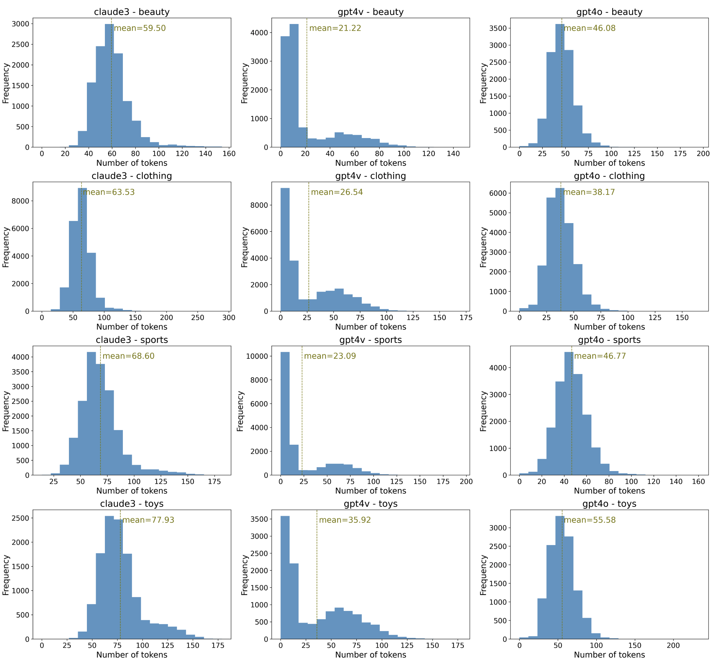

# Amazon Review Plus Dataset

## Overview

The Amazon Review Plus dataset is an enhanced version of the Amazon Review dataset, specifically designed for evaluating multimodal recommendation systems. It includes additional item descriptions generated by Large Vision Language Models (LVLMs) such as GPT-4 Vision, GPT-4o, and Claude-3-Opus. This dataset is used in the MRecBench benchmark to systematically evaluate different LVLM integration strategies in recommendation scenarios.

### Language

The dataset is in English.

## Dataset Access

The dataset can be accessed and downloaded from the following link:

[Download Amazon Review Plus Dataset](https://drive.google.com/file/d/1KgDm4SEkRMuejKiLYSyEhqroUk2oxMsK/view?usp=share_link)

## Dataset Structure

The dataset is organized into several main directories and files, as follows:

```
Amazon_Review_Plus/
│
├── beauty/
│   ├── datamaps.json
│   ├── item2side.json
│   ├── negative_samples.txt
│   └── purchase_history.pkl
│
├── clothing/
│   ├── datamaps.json
│   ├── item2side.json
│   ├── negative_samples.txt
│   └── purchase_history.pkl
│
├── sports/
│   ├── datamaps.json
│   ├── item2side.json
│   ├── negative_samples.txt
│   └── purchase_history.pkl
│
├── toys/
│   ├── datamaps.json
│   ├── item2side.json
│   ├── negative_samples.txt
│   └── purchase_history.pkl
│
├── photos/
│   ├── beauty/
│   ├── clothing/
│   ├── sports/
│   └── toys/
└── README.md
```

Each category directory (`beauty`, `clothing`, `sports`, `toys`) contains the following files:

- **datamaps.json**: Contains mappings of user and item IDs to internal IDs used in the dataset.
- **item2side.json**: Contains side information for each item, including titles, descriptions, and other metadata.
- **negative_samples.txt**: Contains negative samples for evaluation purposes.
- **purchase_history.pkl**: Contains the purchase history of users in a serialized format.

### Sample Files

#### datamaps.json

```json
{
  "user2id": {
    "A1YJEY40YUW4SE": "1",
    "A60XNB876KYML": "2",
    "A3G6XNM240RMWA": "3",
    ...
  },
  "item2id": {
    "7806397051": "4",
    "9759091062": "83",
    ...
  },
  "id2user": {
    "1": "A1YJEY40YUW4SE",
    "2": "A60XNB876KYML",
    "3": "A3G6XNM240RMWA",
    ...
  },
  "id2item": {
    "4": "7806397051",
    "83": "9759091062",
    ...
  }
}
```

#### item2side.json

```json
{
    "83": {
        "asin": "9759091062",
        "title": "Xtreme Brite Brightening Gel 1oz.",
        "description": "Xtreme Brite Brightening gel is a highly concentrated gel that helps to obtain a clearer and brighter complexion. It helps remove blackheads and cosmetic acne.",
        "salesRank": {
            "Beauty": 52254
        },
        "categories": [
            "Beauty",
            "Hair Care",
            "Styling Products",
            "Creams, Gels & Lotions"
        ],
        "price": 19.99,
        "brand": "Xtreme Brite",
        "image": {
            "image_path": "41QWW9v18XL._SY300_.jpg",
            "image_description": {
                "claude3": "The image shows a box and a tube of Xtreme Brite Gel, which appears to be a teeth whitening product. The box is bright pink in color and has the product name prominently displayed. The tube of gel is white with a pink cap. The packaging suggests this is a brightening gel meant to be applied to the teeth to whiten and brighten your smile.",
                "gpt4o": "The image shows a product called \"Xtreme Brite Brightening Gel.\" The product consists of a tube and its packaging box. The tube is white with the product name and description written on it, and the box is pink with similar branding and information. The gel is likely intended for skin brightening purposes.",
                "gpt4v": "Xtreme Brite Brightening Gel 1oz"
            }
        },
        "related": {
            "also_bought": [
                "B0054GLD1U",
                "B003BRZCUC",
                ...
            ],
            "also_viewed": [
                "B0054GBXOW",
                "B0054GLD1U",
                ...
            ],
            "bought_together": [
                "B0054GLD1U"
            ]
        }
    }
}
```

#### negative_samples.txt

```
A1YJEY40YUW4SE B002 B003 B004
A60XNB876KYML B001 B003 B005
...
```

#### purchase_history.pkl

Serialized Python object (use `pickle` to load)

```python
import pickle

with open('path/to/purchase_history.pkl', 'rb') as f:
    purchase_history = pickle.load(f)

print(purchase_history)
# Output example: [['B001', 'B002'], ['B003', 'B004']]
```

### Photos Directory

The `photos` directory contains subdirectories for each category (beauty, clothing, sports, toys). Each subdirectory contains images of the items in that category. The images are used for multimodal recommendation tasks.

## Dataset Statistics

The following table provides detailed statistics for each category in the Amazon Review Plus dataset:


| Category | Users  | Items  | Photos  | Reviews | Sparsity (%) | Avg. Caption Length (Claude-3-opus) | Avg. Caption Length (GPT4-v) | Avg. Caption Length (GPT4-o) |
|----------|--------|--------|---------|---------|--------------|-----------------------------------|-----------------------------|-----------------------------|
| Beauty   | 22,363 | 12,101 | 12,023  | 198,502 | 99.93        | 59.49                             | 21.21                       | 46.08                       |
| Clothing | 39,387 | 23,033 | 22,299  | 278,677 | 99.97        | 63.52                             | 26.53                       | 38.16                       |
| Sports   | 35,598 | 18,357 | 17,943  | 296,337 | 99.95        | 68.59                             | 23.08                       | 46.76                       |
| Toys     | 19,412 | 11,924 | 11,895  | 167,597 | 99.93        | 77.93                             | 35.91                       | 55.57                       |


## Analysis of Image Captions

### Distribution of Token Length

The following figure presents the distribution of token lengths for image captions generated by three different LVLMs (Claude-3-Opus, GPT-4V, GPT-4o) across four categories: beauty, clothing, sports, and toys.

#### Figure 1: Distribution of token lengths for image captions generated by three different LVLMs across four categories.


### Word Cloud

The word cloud visualizes the common terms and themes prevalent in the descriptions produced by each model. The size of each word indicates its frequency within the generated captions.

#### Figure 2: Word cloud for image captions generated by three different LVLMs across four categories.


### Human Evaluation

The human evaluation involved assessing the quality of image captions generated by three LVLMs across four distinct categories. The evaluation metrics included the top1_ratio and the average position (avg_position).


| Dataset | Method           | Eva_1 | Eva_2 | avg_top1_ratio | avg_position |
|---------|------------------|-------|-------|----------------|--------------|
| Beauty  | Claude-3-Opus    | 70.0% | 35.0% | 52.5%          | 1.52         |
|         | GPT-4o           | 30.0% | 60.0% | 45.0%          | 1.68         |
|         | GPT-4V           | 0.0%  | 5.0%  | 2.5%           | 2.80         |
| Toys    | Claude-3-Opus    | 80.0% | 60.0% | 70.0%          | 1.45         |
|         | GPT-4o           | 15.0% | 20.0% | 17.5%          | 2.05         |
|         | GPT-4V           | 5.0%  | 20.0% | 12.5%          | 2.50         |
| Sports  | Claude-3-Opus    | 95.0% | 70.0% | 82.5%          | 1.20         |
|         | GPT-4o           | 5.0%  | 10.0% | 7.5%           | 2.17         |
|         | GPT-4V           | 0.0%  | 20.0% | 10.0%          | 2.62         |
| Clothing| Claude-3-Opus    | 90.0% | 80.0% | 85.0%          | 1.15         |
|         | GPT-4o           | 0.0%  | 10.0% | 5.0%           | 2.25         |
|         | GPT-4V           | 10.0% | 10.0% | 10.0%          | 2.60         |
| Overall | Claude-3-Opus    | 83.8% | 61.3% | 72.5%          | 1.33         |
|         | GPT-4o           | 12.5% | 25.0% | 18.8%          | 2.04         |
|         | GPT-4V           | 3.8%  | 13.8% | 8.8%           | 2.63         |


## Usage

To use the dataset, follow these steps:

1. **Load the Dataset**: Use the provided JSON and PKL files to load the dataset into your environment using the `dataset.py` script.

    ```python
    from dataset import MRecDataset

    dataset_name = 'beauty'
    root_path = '../datasets/Amazon_Review_Plus'
    dataset = MRecDataset(root=root_path, dataset=dataset_name)

    # Access data
    user_id = 'A1YJEY40YUW4SE'
    item_id = '9759091062'
    user_internal_id = dataset.user2id(user_id)
    item_internal_id = dataset.item2id(item_id)
    item_side_info = dataset.item2side(item_id)
    item_image_path = dataset.id2img(item_internal_id)
    instances = dataset.instances()

    print(f"User ID: {user_internal_id}, Item ID: {item_internal_id}")
    print(f"Item Side Information: {item_side_info}")
    print(f"Item Image Path: {item_image_path}")
    print(f"Instances: {instances}")
    ```

2. **Access Photos**: The images are organized by category in the `photos` directory. You can access these images using standard image processing libraries such as PIL (Python Imaging Library).

    ```python
    from PIL import Image

    image_path = 'path/to/photos/beauty/example.jpg'
    image = Image.open(image_path)
    image.show()
    ```

3. **Use for Multimodal Recommendations**: The dataset can be used to train and evaluate multimodal recommendation models by integrating the visual and textual information provided.

## License

The dataset is provided under the Apache 2.0 License. Please refer to the license information provided in the dataset or the original dataset's repository for more details.
